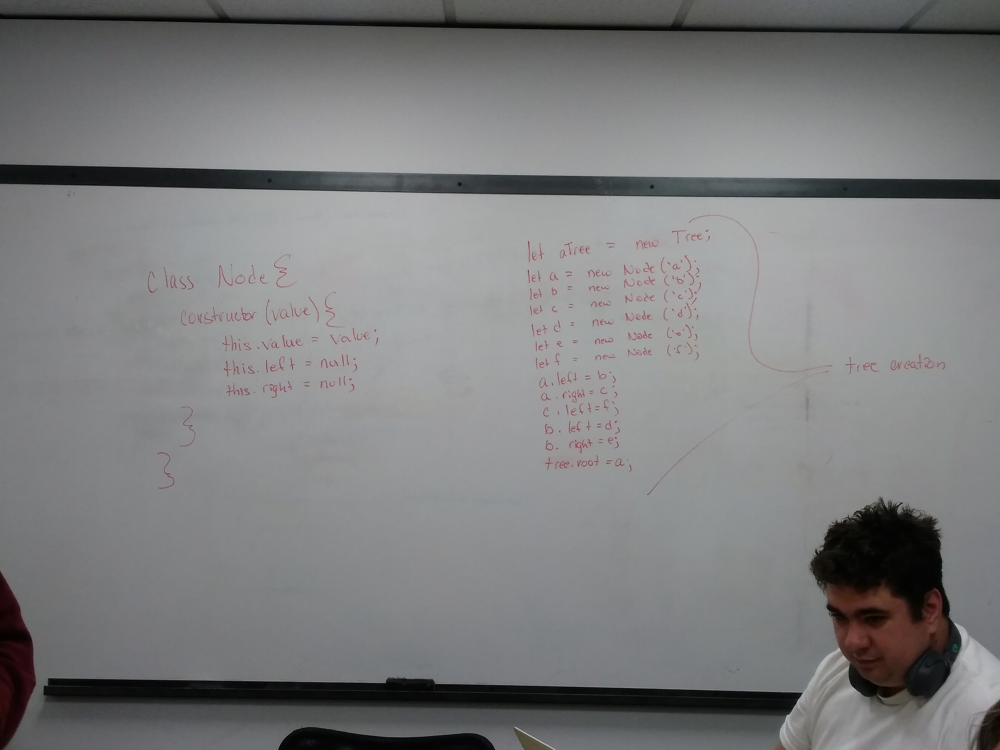
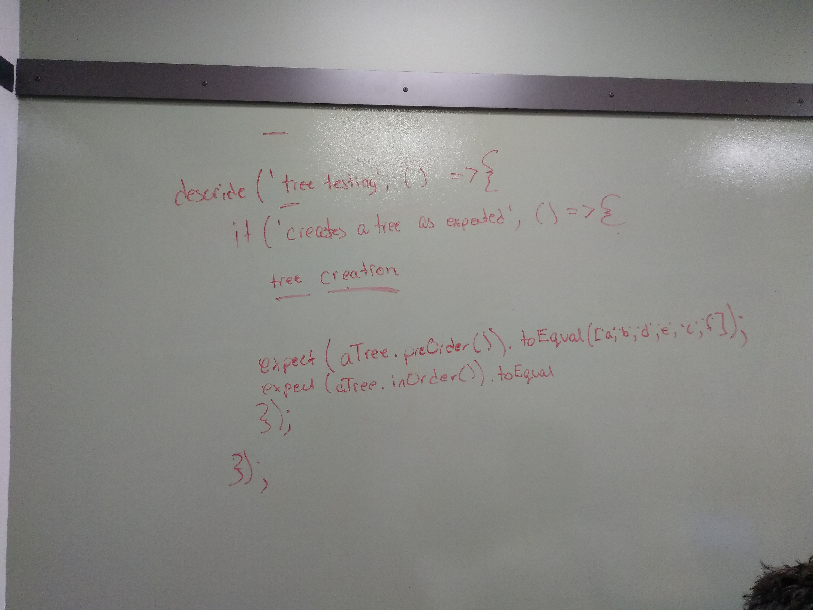
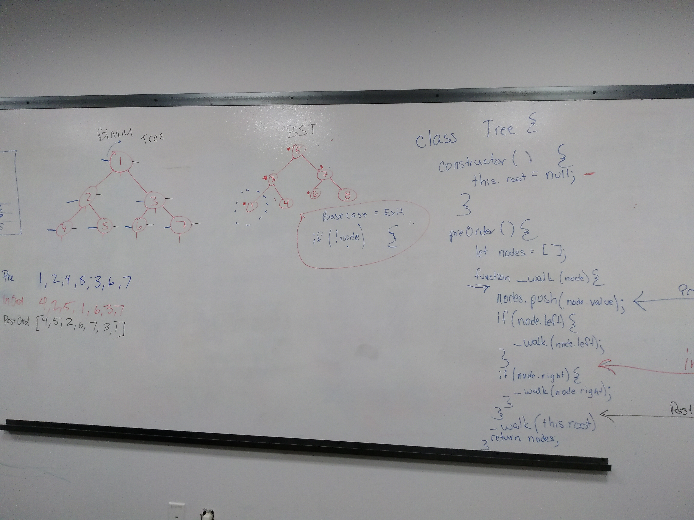

# 401-n12-Code-Challenge

###Whiteboard

##Challenge

Create a binary tree node class and a binary search tree class.

##Approach and Efficiency

I used recursion when possible because it is by default an O(n) operation in time.

pre, post, and inOrder are all O(n) in time and O(h) in space.
add is an O(log n) action as it only has to look at part of the tree.

##Methods

<li>preOrder():
<li>postOrder():
<li>inOrder():
<li>add(node):
  